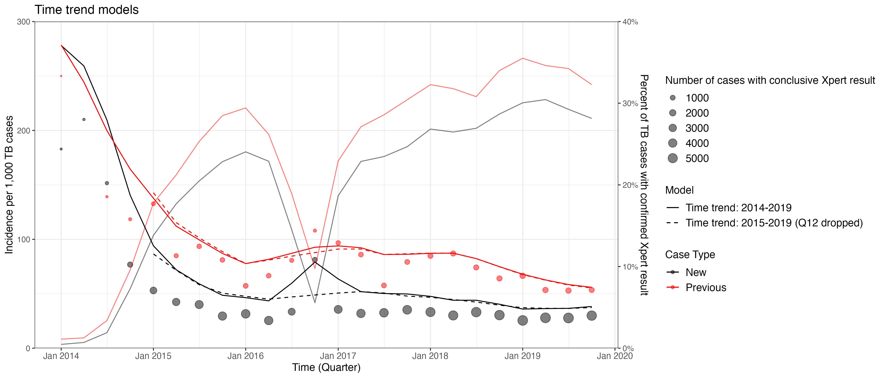
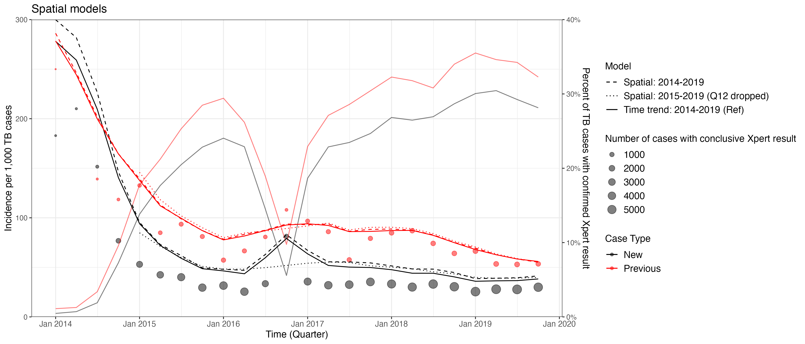
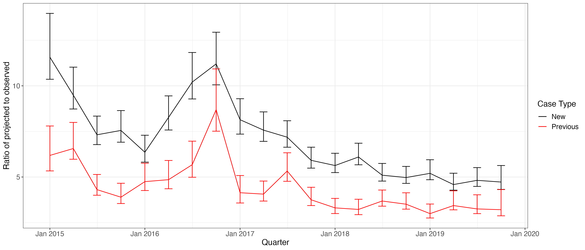
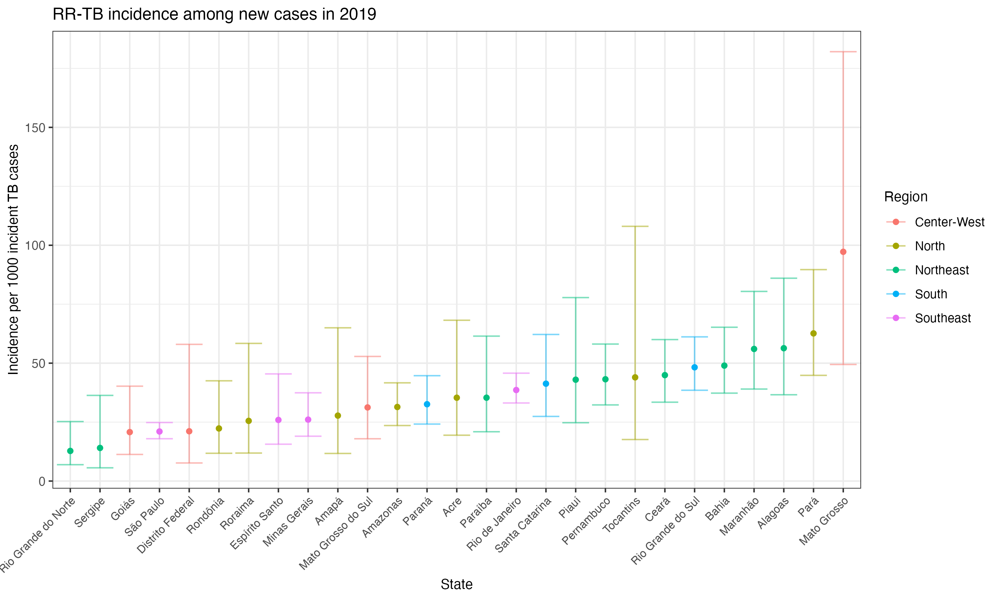
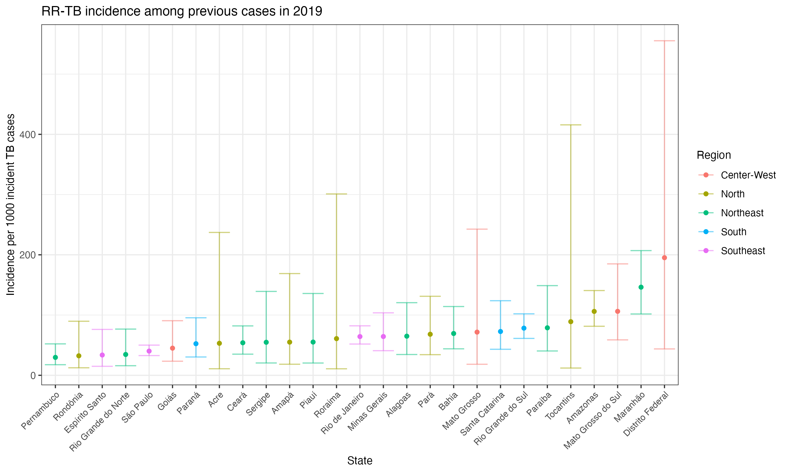
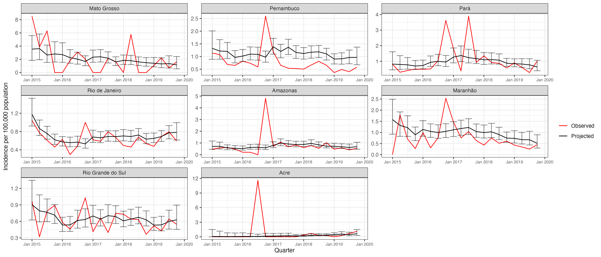
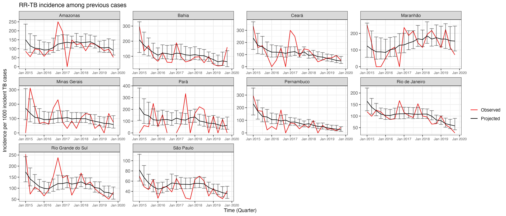
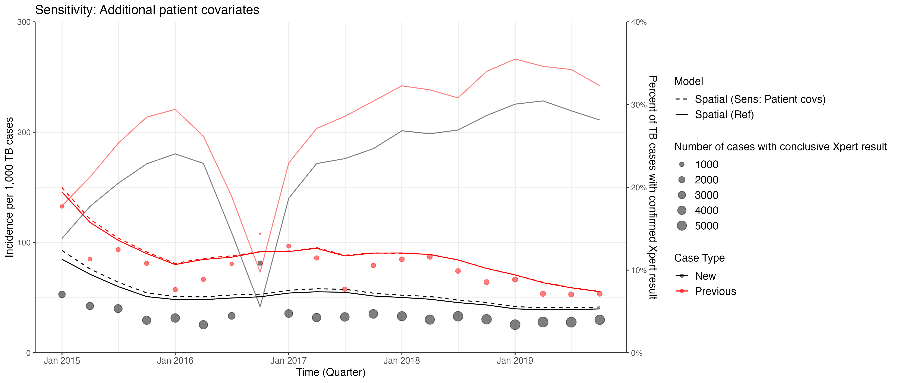
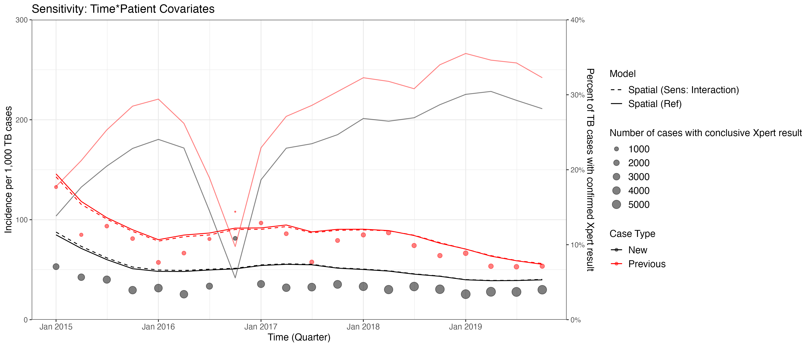

```{r setup, include=FALSE}
## Notes: Takes figures from tt_gam_plots.R 
source(here::here("code/dependencies.R"))
knitr::opts_chunk$set(echo = TRUE)
```

# Project Motivation
National drug resistance surveillance surveys are infrequent and resource-intensive to conduct. Routinely collected data on TB and Rifampin resistant TB (RR-TB) using Gene Xpert covers a much larger sample of individuals and could provide more timely estimates of levels and trends in RR-TB. However, there is heterogeneity in which locations have access to Xpert and, among places that have access, which patients actually get tested. This could potentially introduce bias into estimates of RR-TB using raw data alone. 

- Question: Can we develop a model that addresses these potential biases in Xpert data? What are the implications for estimating levels and trends in RR-TB? 

# Model Specification

We develop a model that estimates national and state-level levels and trends in RR-TB incidence among new and previously treated TB cases between 2014-2019. 
<!-- -   Models risk of positivity by characteristics of patient and municipality where they reside -->

<!-- -   Note: Between 2014-2019, \~3,300 cases diagnosed outside of patient's state of residence; \~88,000 cases diagnosed outside patient's municipality of residence (e.g. cases are not being attributed to municipalities/states in which cases are generated) -->

## Specfication

### Cross-cutting Components: 
-   Random intercept for each state (patient state of residence)
-   Flexible model that pools information across states: A different smooth function for time by state with a shared smoothing parameter; Each state-level smoothing function varies around a grand smooth function for time to allow for pooling across states
-   We include observable patient characteristics that are potentially related to risk of acquiring or developing RR-TB and/or related to being tested with Xpert 

    -   Age
    -   HIV status
    -   Sex
    -   Level of health unit where patient is diagnosed

-  Fit separate models for new cases and previously treated (e.g. relapse and re-entry) cases 
-  Fit model to two different time periods: 
    - 2014-2019 - Full period 
    - 2015-2019, dropping period of Xpert stock outs (Quarter 12) - Excluding early implementation noise and stock outs in 2016 during which testing dropped sharply
  

### Specifications
#### 1. Time trend model

We build on the above by including several characteristics of the municipality where a patient resides that are potentially connected to underlying RR-TB prevalence and access to Xpert:

- Urbanicity - Percent of the population in urban setting (2010 census) 
- Bolsa Familia coverage - Percent of the population benefiting from BF
- Presence of a prison - Municipality has prison at some point during 2014-2019 period (SISPEN)
- FHS Coverage - Average number of health teams per 4,000 people
- Border - Whether the municipality borders another country
    
This specification assumes that the relationship between patient- and municipality-characteristics and whether someone gets tested with Xpert or their risk of RR-TB is not varying over time or by state.

#### Time trend model
```{r tt specification, eval = FALSE}
result ~ s(state, bs = "re") + s(time) + s(time, by = state, id = 1) + age_cat + hiv_status + 
  sex + health_unit + border + bf_cat + urban_cat + has_prison + fhs_cat
```


#### 2. Spatial model

In the spatial model, we are no longer explicitly specifying which municipality characteristics we think are associated with RR-TB positivity or being tested with Xpert. Under the time trend model, we might be missing other important predictors that are either included in Sinan, but that we haven't included in our model, or that are unobservable. The spatial model captures these unobservable aspects that are not varying overtime. Latitude and longitude are based off the municipality centroid. 

```{r spatial specification, eval = FALSE}
result ~ s(state, bs = "re") + s(time) + s(time, by = state, id = 1) + s(lat, lon) + 
  age_cat + hiv_status + sex + health_unit
```


# Model Output

## National-level estimates
The following figures depict Xpert testing trends as well as the observed and projected RR-TB incidence per 1,000 TB cases (on the left axis) and percent of total TB cases tested with Xpert (on the right axis). We define tested as cases with a conclusive Xpert test result. The size of the observations correspond to the number of cases with a conclusive Xpert test result for a given quarter. Observed RR-TB incidence is defined as the share of cases with a conclusive Xpert test result with a positive test per 1,000 TB cases. 

The first figure depicts the projected RR-TB incidence using the time trend models for both 2014-2019 and 2015-2019 (dropping quarter 12). 
```{r echo=FALSE, out.width = "110%"}

```

The second figure depicts the projected RR-TB incidence using the spatial models for both 2014-2019 and 2015-2019 (dropping quarter 12), with the time trend model for 2014-2019 as a reference point to compare estimates across models. 
```{r, echo=FALSE, out.width = "110%"}

```

<!-- ## Bias -->
<!-- We now provide a comparison how "biased" the observed data is relative to projected number of RR-TB cases. Comparing projected to observed, we interpret this as how many times higher he  -->

<!-- We derive estimates using the spatial model for 2015-2019, dropping the quarter that experienced stock outs.  -->
<!-- ```{r, echo=FALSE, out.width = "110%"} -->
<!--  -->
<!-- ``` -->


## State-level estimates

The following figures provide a snapshot of RR-TB incidence in 2019 among all states derived from the spatial model. These include point estimates from the fitted models and 95\% uncertainty intervals. 

```{r, echo=FALSE, out.width = "110%"}

```


```{r, echo=FALSE, out.width = "110%"}

```


The following two figures compare trends in projected (black) and observed (red) RR-TB incidence between 2015-2019 for a subset of states determined by their absolute number of TB cases. These include point estimates from the fitted models and 95\% uncertainty intervals. States are ordered alphabetically. 
```{r, echo=FALSE, out.width = "115%"}

```

```{r, echo=FALSE, out.width = "115%"}

```


## Sensitivity Analyses

### 1. Additional patient covariates
We might be worried that the patient covariates we've included are not the only factors that determine whether or not a patient is tested with Xpert or their risk of having RR-TB. We include other coviariates to explore whether our previous estimates are robust or vary: 

```{r, eval = FALSE}
result ~ s(state, bs = "re") + s(time) + s(time, by = state, id = 1) + s(lat, lon) + 
  age_cat + hiv_status + sex + health_unit + homeless + incarcerated + smokes + 
  uses_alcohol + uses_drugs + has_diabetes
```
- Note: Education and immigration status forthcoming

```{r, echo = FALSE, out.width = "110%"}

```


### 2. Selection effects 
Our primary model follows the assumption that the relationship between observable patient characteristics, RR-TB incidence, and getting tested with Xpert does not vary overtime. While the biological relationship between these characteristics and RR-TB incidence may be less likely to vary overtime, we might worry that the likelihood that a patient is tested based on these observable characteristics could change overtime. 

```{r, eval = FALSE}
result ~ s(state, bs = "re") + s(time) + s(time, by = state, id = 1) + s(lat, lon) + 
  age_cat + hiv_status + sex + health_unit + s(time, by = age_cat) + 
  s(time, by = hiv_status) + s(time, by = sex) + s(time, by = health_unit)
```


```{r, echo = FALSE, out.width = "110%"}

```


```{r, echo = FALSE, eval = FALSE}
## All models together

```

