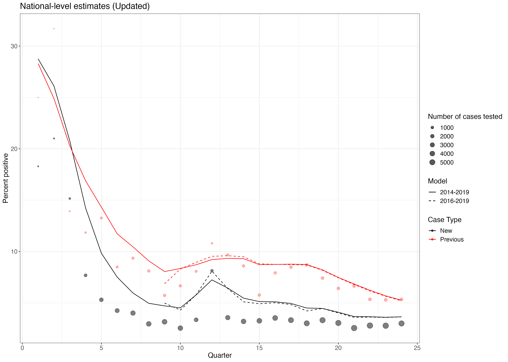
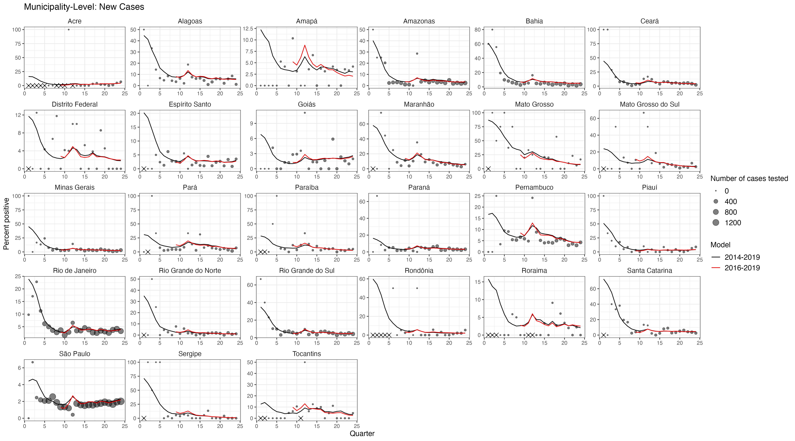
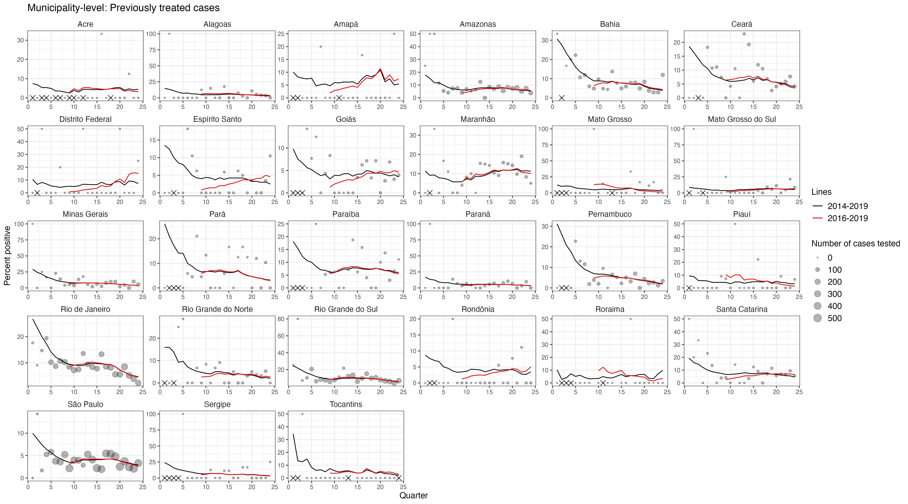
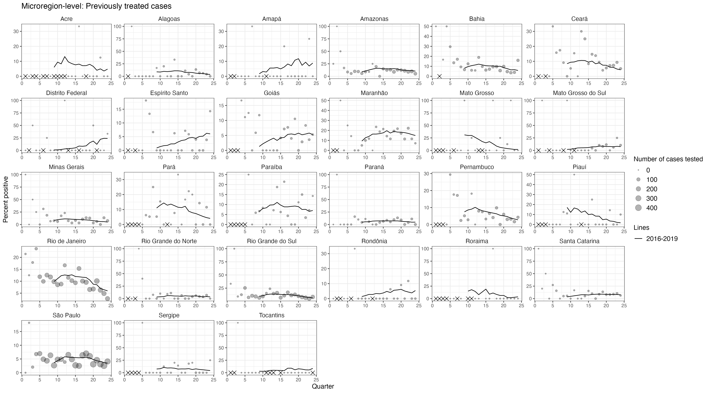
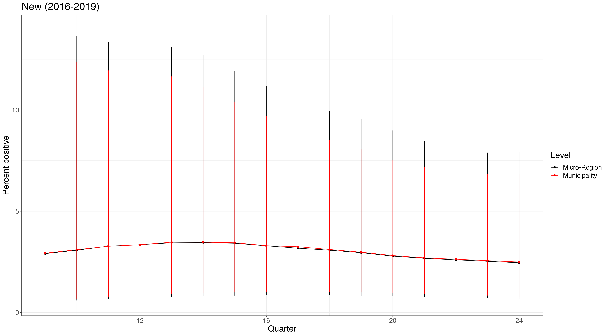
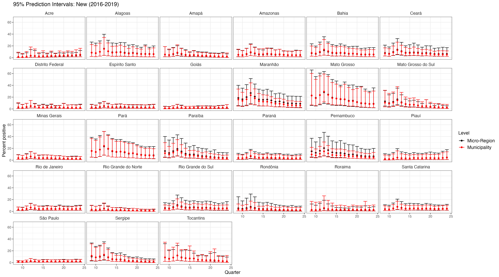
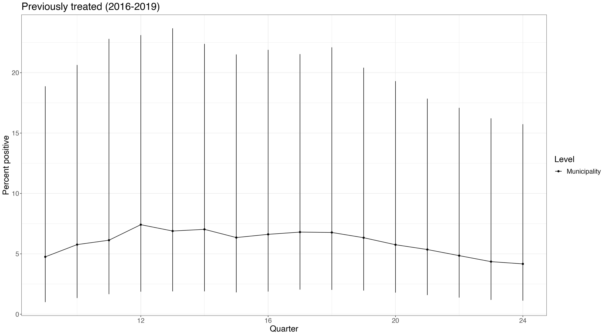
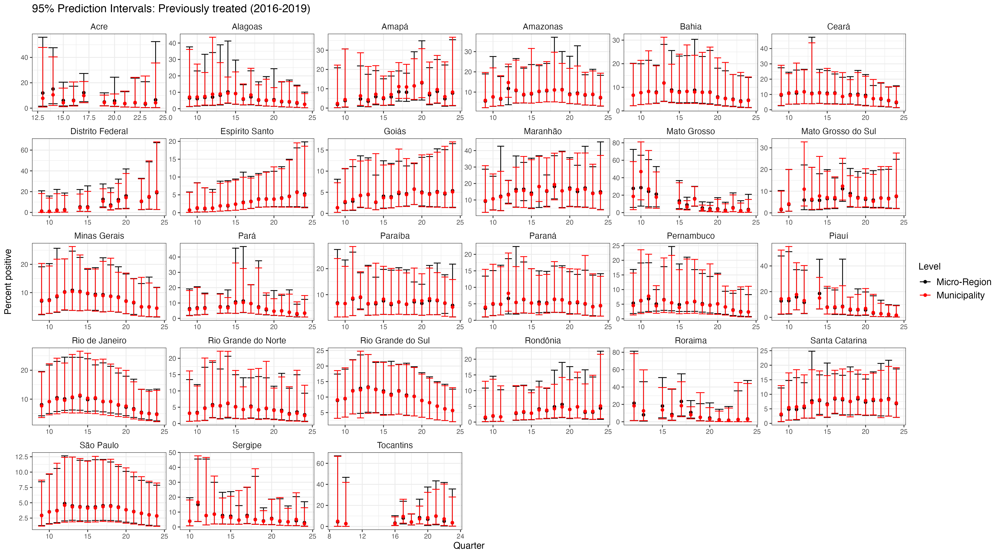

```{r setup, include=FALSE}
## Notes: Takes figures from tt_gam_plots.R 
source(here::here("code/dependencies.R"))
knitr::opts_chunk$set(echo = TRUE)
```

# Model Specification

### Motivation


### Overview

-   Estimate state-level prevalence of Rif positive cases per quarter among incident TB cases between 2014-2019

-   Fit smoothing functions to reduce the noise we were seeing in previous models

<!-- -   Models risk of positivity by characteristics of patient and municipality where they reside -->

    <!-- -   Note: Between 2014-2019, \~3,300 cases diagnosed outside of patient's state of residence; \~88,000 cases diagnosed outside patient's municipality of residence (e.g. cases are not being attributed to municipalities/states in which cases are generated) -->

-   Separate models for new cases and previously treated (e.g. relapse and re-entry) cases 

### Set Up

```{r model specification, eval = FALSE}
result ~ s(state, bs = "re") + s(time) + s(time, by = state, id = 1) + age_cat + hiv_status + sex + health_unit + bf_cat + urban_cat + has_prison + fhs_cat
```

-   Random intercept for each state (patient state of residence)

-   A different smooth function for time by state with a shared smoothing parameter

-   Each state-level smoothing parameter varies around a grand smooth function for time to allow for pooling across states

-   Fixed effects for patient-level characteristics:

    -   Age
    -   HIV status
    -   Sex
    -   Level of health unit where patient is diagnosed - Based on CNES merge

-   Fixed effects for characteristics of municipality where patient resides: 
    -   Also ran at micro-region level to compare, but similar point estimates, wider uncertainity intervals, also municipality seems more policy relevant
    -   Urbanicity - Percent of the population in urban setting (2010 census)
    -   Bolsa Familia coverage - Percent of the population benefiting from BF (BF: SAGICAD, 2018; Denominator: 2010 Census)
    -   Presence of prison - Municipality has prison at some point during 2014-2019 period (SISPEN)
    -   FHS Coverage - Average number of health teams per 4,000 people between 2014-2019

### Specifications

- Time periods: 
  - 1) 2014-2019 - Full period 
  - 2) 2016-2019 - Excluding implementation noise
  - 3) 2017-2019 - Excluding stock outs 

-   Run separately by case type (new vs. previously treated (relapse, re-entry))


# Model Output

## National-level estimates

```{r echo=FALSE}

```


## State-level estimates (Updated)

### New Cases

Municipality-level

```{r mun.new, echo=FALSE}

```

### Previous Cases (Updated)

A. Municipality-level (Updated)

```{r mun.prev, echo=FALSE}

```

B. Microregion-level (Updated)

```{r mic.prev, echo=FALSE}

```

<!-- C. Municipality and Micro-region -->

<!-- ```{r mun.mic.prev, eval=FALSE, include=FALSE, out.width=} -->
<!-- knitr::include_graphics("output/plots/plot_mun.mic_prev.png") -->
<!-- ``` -->


## Bootstrapped Results
### New Cases (Updated)
```{r boot.new, echo=FALSE}


```


### Previous Cases
```{r boot.prev, echo=FALSE}


```


<!-- ## Maps  -->
<!-- ### New Cases -->
<!-- ```{r map.new_state, echo = FALSE, out.width = '100%'} -->
<!-- # knitr::include_graphics("output/fig/fig_map_new_st.png") -->
<!-- ``` -->

<!-- ### Previous Cases -->
<!-- ```{r map.prev_state, echo = FALSE, out.width = '100%'} -->
<!-- # knitr::include_graphics("output/fig/fig_map_prev_st.png") -->
<!-- ``` -->